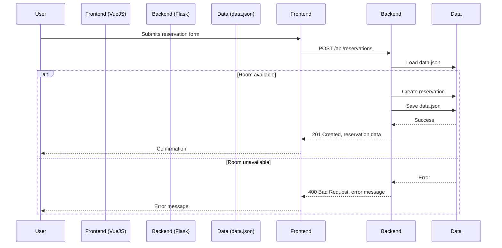
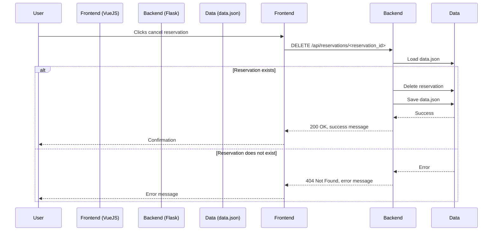

# Travel Reservations App

This project is a simple web application for managing hotel reservations. It is built using Flask for the backend and VueJS for the frontend. The application uses local JSON data to simulate a database. VueJS and Tailwind CSS are loaded via CDN, eliminating the need for a frontend build step.

## Executive Summary

The Travel Reservations App provides a user-friendly interface for managing hotel room bookings. It allows users to view available rooms, make reservations, and cancel existing bookings. The application is designed with a simple architecture, utilizing Flask for the backend API and VueJS for the interactive frontend. Data is stored in a local JSON file, making it easy to deploy and run without a dedicated database server. This setup is ideal for small-scale projects or for demonstration purposes.

## Features

- View available hotel rooms.
- Make a reservation for an available room.
- Cancel an existing reservation.
- View all current reservations.

## Technologies Used

- **Backend**: Flask (Python)
- **Frontend**: VueJS 3 (loaded via CDN), Tailwind CSS (via CDN)
- **Data Storage**: Local `data.json` file

## Prerequisites

Before you begin, ensure you have the following installed:

- Python 3.x (3.7+ recommended for type hints)
- pip (Python package installer)

## Project Structure

```
/
├── static/             # Static files served by Flask
│   └── js/
│       └── main.js     # Compiled/copied frontend JavaScript
├── src/                # Source files (not directly served)
│   └── main.js         # VueJS source code
├── templates/          # HTML templates (Jinja2)
│   └── index.html      # Main page template
├── .env                # Local environment variables (DO NOT COMMIT)
├── .env.example        # Example environment variables
├── .gitignore          # Git ignore rules
├── app.py              # Main Flask application (backend API)
├── data.json           # Data store (rooms, reservations)
├── requirements.txt    # Python dependencies
├── README.md           # This file
└── Changelog.md        # Record of changes
```

## Setup Instructions

1.  **Clone the repository**:
    ```bash
    git clone <repository-url>
    cd travel-reservation-models
    ```

2.  **Set up Python Virtual Environment & Install Backend Dependencies**:
    ```bash
    # Create a virtual environment (recommended)
    python3 -m venv venv
    # Activate it (macOS/Linux)
    source venv/bin/activate
    # Activate it (Windows)
    # venv\\Scripts\\activate

    # Install Python dependencies
    pip install -r requirements.txt
    ```

3.  **Prepare Frontend JavaScript**:
    The frontend JavaScript (`src/main.js`) needs to be copied to the static directory to be served by Flask.
    ```bash
    # On macOS/Linux
    cp src/main.js static/js/main.js

    # On Windows
    # copy src\\main.js static\\js\\main.js
    ```
    *(Note: You need to repeat this copy step whenever you modify `src/main.js`)*

4.  **Set up environment variables**:
    Copy the example environment file:
    ```bash
    cp .env.example .env
    ```
    Modify `.env` if necessary (e.g., set `FLASK_DEBUG=1` for development).

5.  **Run the Application**:
    ```bash
    # Ensure your virtual environment is active
    python3 app.py
    ```
    *(Alternatively, for development mode with auto-reload for backend changes):*
    ```bash
    # Ensure your virtual environment is active
    # export FLASK_APP=app.py # Use `set` on Windows
    # export FLASK_ENV=development # Optional: enables debug mode and auto-reload
    # The app.py now reads FLASK_DEBUG from .env, so setting FLASK_ENV is less critical
    python3 app.py # Will run in debug if FLASK_DEBUG=1 in .env
    ```
    *(Or using Flask CLI if preferred):*
     ```bash
    # Ensure your virtual environment is active
    # export FLASK_APP=app.py # Use `set` on Windows
    python3 -m flask run # Reads FLASK_DEBUG from .env
    ```


6.  **Access the application**:
    Open your browser and navigate to `http://127.0.0.1:5000` (or the host/port specified if changed).

## Development

Development involves running the Flask backend and manually copying the frontend JavaScript file after making changes.

1.  **Run the Flask Backend (Development Mode)**:
    Ensure `FLASK_DEBUG=1` is set in your `.env` file.
    ```bash
    # Ensure your virtual environment is active
    python3 app.py
    ```
    The backend will run on `http://127.0.0.1:5000` (by default) and automatically reload when backend Python files change.

2.  **Modify Frontend JavaScript**:
    Edit the `src/main.js` file.

3.  **Copy Updated Frontend JavaScript**:
    After saving changes to `src/main.js`, copy it to the static folder:
    ```bash
    # On macOS/Linux
    cp src/main.js static/js/main.js

    # On Windows
    # copy src\\main.js static\\js\\main.js
    ```

4.  **Refresh Browser**: Refresh your browser page (`http://127.0.0.1:5000`) to see the frontend changes.

## API Endpoints

The Vue frontend interacts with the Flask backend via the following API endpoints:

### GET /api/rooms

Retrieves a list of all rooms.

**Response:**

```json
[
  {
    "id": 1,
    "name": "Standard Queen",
    "availability": 5,
    "price": 120
  },
  {
    "id": 2,
    "name": "Deluxe King",
    "availability": 3,
    "price": 180
  }
]
```

### GET /api/reservations

Retrieves a list of all reservations.

**Response:**

```json
[
  {
    "id": "res1_abcdef12",
    "roomId": 1,
    "guestName": "John Doe",
    "checkIn": "2025-05-01",
    "checkOut": "2025-05-05"
  }
]
```

### POST /api/reservations

Creates a new reservation. Expects JSON payload:

**Request Body:**

```json
{
  "roomId": 1,
  "guestName": "Jane Doe",
  "checkIn": "YYYY-MM-DD",
  "checkOut": "YYYY-MM-DD"
}
```

**Response (Success - 201 Created):**

```json
{
  "id": "res2_fedcba21",
  "roomId": 1,
  "guestName": "Jane Doe",
  "checkIn": "YYYY-MM-DD",
  "checkOut": "YYYY-MM-DD"
}
```

**Response (Error - 400 Bad Request):**

```json
{
  "error": "Missing required reservation data"
}
```

### DELETE /api/reservations/\<reservation_id>

Cancels an existing reservation using its string ID.

**Response (Success - 200 OK):**

```json
{
  "message": "Reservation res1_abcdef12 cancelled successfully"
}
```

**Response (Error - 404 Not Found):**

```json
{
  "error": "Reservation ID res1_abcdef12 not found"
}
```

## Workflow Diagrams

### Reservation Workflow



### Cancellation Workflow



## Environment Variables

*   `FLASK_DEBUG`: Set to `1` to enable Flask's debug mode (auto-reloading, interactive debugger). Defaults to `0` (off).
*   `FLASK_RUN_HOST`: Host address to bind the server to (e.g., `0.0.0.0` to listen on all interfaces). Defaults to `127.0.0.1`.
*   `FLASK_RUN_PORT`: Port number for the server. Defaults to `5000`.

*(Add these to `.env` and `.env.example` if you need to change defaults)*

## Data Management

The application uses a `data.json` file to store information about hotel rooms and reservations. This file is read from and written to by the Flask backend.

**Example `data.json` structure:**

```json
{
  "rooms": [
    { "id": 1, "name": "Standard Queen", "availability": 5 },
    { "id": 2, "name": "Deluxe King", "availability": 3 }
  ],
  "reservations": [
    { "id": "res1_abcdef12", "roomId": 1, "guestName": "John Doe", "checkIn": "2025-05-01", "checkOut": "2025-05-05" }
  ]
}
```

## Contributing

Contributions are welcome! Please fork the repository and submit a pull request for any enhancements or bug fixes.

## License

This project is licensed under the MIT License. See the LICENSE file for details.